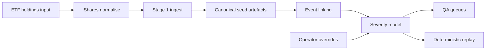

# Vendor-Agnostic Dividend Event Ingestion & QA Engine (`divpipe`)

`divpipe` is a vendor-agnostic dividend event ingestion and QA engine for imperfect corporate-action datasets.

It is designed for reproducible, auditable handling of:
- missing or inconsistent dividend fields
- mapping failures and unsupported tickers
- ambiguous duplicate / overlapping observations
- deterministic replay with explicit operator overrides

The goal is not “perfect sourcing”, but a stable QA surface for reproducible review: canonical seed artefacts, linked event rows, severity summaries, and operator queues.



Core outputs:
- `seed_yfinance_dividends_all.csv` — canonical seed rows
- `econ_severity_summary.csv` — econ-level review surface
- `qa_queue__econ.csv` / `qa_queue__rows.csv` — operator action queues

---

## Overview

This repository focuses on **reproducible QA for imperfect dividend and corporate-action datasets** used in futures / ETF-linked workflows.

Rather than auto-resolving every ambiguity, `divpipe` produces a stable review surface:
- canonical seed artefacts from provider pulls
- deterministic event linking into `economic_event_id`
- severity summaries and QA queues for operator review
- replayable decisions via local override files

All outputs are fixed, reviewable artefacts (CSVs) enabling a clean QA loop:
- inspect failures and risk surfaces
- apply controlled operator decisions (`data/overrides/qa_decisions.csv`, **do not commit**) and replay deterministically offline
- keep public demo decision examples under `data/overrides/*demo*.csv` while real operational decisions remain local

---

## Official workflow (v1)

**Official commands are `divpipe` only.**  
Anything under `python -m ...` or `python scripts/...` is **internal/dev-only** (see bottom).

v1 is deliberately **not** an auto-deduplication engine. It surfaces ambiguity into QA queues and applies explicit operator decisions via overrides.

---

## Quickstart (one copy/paste block)

```bash
# (optional) fresh editable install
python -m pip uninstall -y msci-fv-engine || true
python -m pip install -e .

# Stage 0: iShares holdings (download -> normalise) [ONLINE]
divpipe ishares download  --etf EEM --out data/raw/ishares
divpipe ishares download  --etf EFA --out data/raw/ishares

# NOTE: normalise requires a local mapping file (do not commit).
# If you don't have data/mapping.csv yet, skip normalise and use the offline demo below.
divpipe ishares normalise --etf EEM --map data/mapping.csv
divpipe ishares normalise --etf EFA --map data/mapping.csv

# Stage 1: ingest (online) -> writes run_root + refreshes output/runs/latest [ONLINE]
# NOTE: requires holdings min CSVs (typically produced by the normalise step above).
divpipe ingest \
  --holdings data/holdings_EEM_min.csv data/holdings_EFA_min.csv \
  --bgn 20240101 \
  --end 20260213

# Stage 2: severity + QA queues (offline-capable) [OFFLINE OK if Stage 1 seed artefacts exist]
# NOTE: qa_decisions.csv is local-only (do not commit).
# If the file does not exist, Stage 2 will create a template CSV at that path and exit.
divpipe severity \
  --qa-decisions data/overrides/qa_decisions.csv
```

Notes:
- If `--qa-decisions` does not exist, Stage 2 creates a template CSV and exits. Fill it, then re-run Stage 2.
- Stage 2 is offline-capable as long as the Stage 1 seed artefacts remain under the run root.


---
## Demo run (offline) — deterministic Stage 2 replay from committed seed artefacts

This demo is **100% offline**: no yfinance, no iShares, no network calls.
It replays **Stage 2 (severity + QA queues)** deterministically using **committed Stage 1 seed artefacts** under `data/sample/`.

Notes:
- The demo skips Stage 1 and deterministically replays Stage 2 from committed seed artefacts.
- `divpipe severity --run-root ...` is an official flag that tells Stage 2 which run root to use (i.e. where the Stage 1 seed artefacts live).

### Demo fixtures (committed)

Required demo files:

- `data/sample/stage1_seed/seed_yfinance_dividends_all.csv`
- `data/sample/stage1_seed/seed_yfinance_errors_all.csv`
- `data/sample/stage1_seed/seed_yfinance_no_dividends_all.csv`
- `data/sample/overrides/qa_decisions_demo.csv`

Additional notes:
- Demo seeds are intentionally small (tens to hundreds of rows).
- `qa_decisions_demo.csv` is a public **example** decisions file for deterministic replay.
- Real ops decisions stay local and uncommitted (`data/overrides/qa_decisions.csv`).

---

### Demo command (single copy/paste)

```bash
# 1) Create a local run-root (do NOT commit this)
RUN_ROOT="output/runs/divpipe__demo_offline"
mkdir -p "${RUN_ROOT}/stage1_seed"

cp -f data/sample/stage1_seed/seed_yfinance_dividends_all.csv      "${RUN_ROOT}/stage1_seed/"
cp -f data/sample/stage1_seed/seed_yfinance_errors_all.csv        "${RUN_ROOT}/stage1_seed/"
cp -f data/sample/stage1_seed/seed_yfinance_no_dividends_all.csv  "${RUN_ROOT}/stage1_seed/"

# (optional) keep the normal workflow pointer
mkdir -p output/runs
rm -f output/runs/latest
ln -s "$(python -c "import os; print(os.path.abspath('${RUN_ROOT}'))")" output/runs/latest

# 2) Run Stage 2 (OFFLINE) using the committed demo decisions
divpipe severity \
  --run-root "${RUN_ROOT}" \
  --qa-decisions data/sample/overrides/qa_decisions_demo.csv
```

---

### Expected outputs

Stage 2 writes under the run root (typical layout):

```text
output/runs/divpipe__demo_offline/
  stage1_seed/
    seed_yfinance_dividends_all.csv
    seed_yfinance_errors_all.csv
    seed_yfinance_no_dividends_all.csv
  stage2_analysis/
    seed_yfinance_dividends_all__linked_severity.csv
    econ_severity_summary.csv
    qa_queue__econ.csv
    qa_queue__rows.csv
```

Quick sanity checks:

```bash
test -f "${RUN_ROOT}/stage2_analysis/econ_severity_summary.csv"
test -f "${RUN_ROOT}/stage2_analysis/qa_queue__econ.csv"
test -f "${RUN_ROOT}/stage2_analysis/qa_queue__rows.csv"
```

---

### What the demo proves

- Stage 2 can run deterministically **offline** given fixed Stage 1 seed artefacts.
- Tier 0/1 risk surfaces are reproducibly generated into QA queues.
- Operator overrides (`qa_decisions_demo.csv`) are applied deterministically on replay.

---

## Canonical daily ops workflow (v1)

### Stage 0) iShares holdings: Raw download → Normalise → divpipe input

**File naming contract (DDMMYYYY)**
- Raw cache filename: `data/raw/ishares/<DDMMYYYY>_<ETF>.csv`
- Raw audit versions (content-diff only): `data/raw_versions/ishares/<ETF>/<DDMMYYYY>/raw_<n>.csv`
- Normalised outputs:
  - Minimal (divpipe input): `data/holdings_<ETF>_min.csv`
  - Full (enriched): `data/holdings_<ETF>_full.csv`

Download raw (online):
```bash
divpipe ishares download --etf EEM --out data/raw/ishares
divpipe ishares download --etf EFA --out data/raw/ishares
```

Normalise to divpipe holdings (offline-capable after raw exists):
```bash
divpipe ishares normalise --etf EEM --map data/mapping.csv
divpipe ishares normalise --etf EFA --map data/mapping.csv
```

Optional: emit missing mapping candidates:
```bash
divpipe ishares normalise --etf EEM --map data/mapping.csv --emit-missing-map output/missing_map_EEM.csv
divpipe ishares normalise --etf EFA --map data/mapping.csv --emit-missing-map output/missing_map_EFA.csv
```

QC behaviour (fail-fast):
- Raises if equity weights do not sum to ~1.0 (±2%) or if too many non-positive weights.

---

### Stage 1) Ingest (online)

Stage 1 always creates a new run root and refreshes `output/runs/latest` to an **absolute** symlink.

```bash
divpipe ingest \
  --holdings data/holdings_EEM_min.csv data/holdings_EFA_min.csv \
  --bgn 20240101 \
  --end 20260213
```

Stage 1 writes run-root seed artefacts:
- `seed_yfinance_dividends_all.csv`
- `seed_yfinance_errors_all.csv`
- `seed_yfinance_no_dividends_all.csv`

---

### Stage 2) Severity + QA queues (offline)

Default: use `output/runs/latest` automatically (recommended):
```bash
divpipe severity \
  --qa-decisions data/overrides/qa_decisions.csv
```

Optional: respect pre-seeded economic ids (only fill missing values):
```bash
divpipe severity \
  --respect-existing-econ-id \
  --qa-decisions data/overrides/qa_decisions.csv
```

Stage 2 writes:
- `seed_yfinance_dividends_all__linked_severity.csv`
- `econ_severity_summary.csv`
- `qa_queue__econ.csv`
- `qa_queue__rows.csv`

---

## Run output contract (v1)

All run artefacts are produced under:
- `output/runs/<run_id>/`

A stable pointer is maintained:
- `output/runs/latest` → the most recent run root

Run-root resolution rule (Stage 2):
1) Prefer `output/runs/latest` if present  
2) Otherwise, pick the newest `output/runs/divpipe__*` by mtime  
3) Always print the resolved `run_root` to stdout

---

## Artefacts spec (operational contract)

| File | Produced by | Purpose | How you use it                                         |
|---|-------------|---|--------------------------------------------------------|
| `seed_yfinance_dividends_all.csv` | Stage 1     | Provider-ingested dividend rows (canonical schema) | Stage 2 input + offline replay baseline                |
| `seed_yfinance_errors_all.csv` | Stage 1     | Provider-level hard failures / errors | Drives mapping fixes / error taxonomy                  |
| `seed_yfinance_no_dividends_all.csv` | Stage 1     | Tickers that exist but yielded no dividends in the window | Decide “real no-div” vs mapping failure vs unsupported |
| `seed_yfinance_dividends_all__linked_severity.csv` | Stage 2     | Row-level data + `economic_event_id` + `severity_tier` | Primary row dataset for downstream use                 |
| `econ_severity_summary.csv` | Stage 2     | Econ-level severity summary | Triage surface for review                              |
| `qa_queue__econ.csv` | Stage 2     | Tier 0/1 econ events | Your work queue                                        |
| `qa_queue__rows.csv` | Stage 2     | Row slice for Tier 0/1 econ events | Evidence rows to decide overrides                      |

**Note on `seed_yfinance_no_dividends_all.csv`**
- Diagnostic log (not an error).
- Includes: (i) unsupported tickers (`exists_ticker=UNSUPPORTED_YF`), (ii) genuinely no dividends in the window, (iii) possible coverage gaps or mapping issues.
- Use `exists_ticker` first, then triage using `candidates` and optional cross-checks.

---

## Overlap patterns (O1–O6) and how v1 handles them

Definition (v1): overlap means “multiple vendor rows that might represent the same economic cashflow event or might represent distinct events”.

v1 does not auto-resolve overlap. It detects it, tiers it and routes it into QA / decisions.

### O1 — Split / instalments (usually low risk)
- Same underlying, same ex_date, multiple pay_date.
- v1: usually Tier ≥ 2 unless currency flip / identity issues.
- Action: usually none.

### O2 — Same-date amount collision (ambiguous)
- Same underlying, same ex_date, same pay_date, different amount.
- v1: usually Tier 1 (Tier 0 if mixed currency / integrity signals).
- Action: typically DROP the non-canonical row or explicitly SET_ECON_ID logic via decisions.

### O3 — Ex-date drift / shift (ambiguous anchor)
- Same underlying, similar amount/ccy and often similar pay_date, but ex_date differs by ±N days.
- v1: usually Tier 1 for small drift with strong agreement; Tier 0 for larger drift / extra discrepancies.
- Action: SET_ANCHOR_DATE / SET_ECON_ID / DROP depending on truth.

### O4 — Vendor identity conflict (integrity violation → fail-fast)
- Same vendor_event_id implies conflicting identity.
- v1: fail-fast at validation.
- Action: fix upstream normalisation / mapping, re-seed, re-run.

### O5 — Currency flip / mixed currency representation (high risk)
- Same underlying and nearby dates, but div_ccy differs.
- v1: Tier 0.
- Action: usually DROP non-canonical currency row, or keep both with explicit downstream rules.

### O6 — Share-class / action collision (context-dependent)
- Similar dates/amounts across related tickers or mixed action types.
- v1: Tier 1 by default; Tier 0 if action-type conflict flags exist.
- Action: SET_ECON_ID if you intentionally join/split; otherwise leave separate.

---

## Severity model

Naive “auto-clustering everything” causes silent loss or double-counting.  
Tiering forces human review only where clustering risk is high.

Tier meaning:
- **Tier 0 / Tier 1**: do not auto-use. Human review required.
- **Tier 2+**: auto-usable (policy can be tightened later)

Econ-level signals include:
- `row_count`
- within-cluster amount diversity (`amount_nunique`)
- date dispersion (`anchor_spread_days`)
- overlap signals: `pay_date_nunique`, `div_ccy_nunique`, `vendor_event_id_nunique`

---

## QA decisions (operator control)

### Location (do not commit)
Recommended path:
- `data/overrides/qa_decisions.csv`

### Schema

Required columns:
- `vendor_event_id`
- `underlying`
- `ex_date`
- `action`

Optional columns:
- `amount`
- `div_ccy`
- `economic_event_id`
- `anchor_date`
- `note`

Valid actions:
- `DROP`
- `SET_ECON_ID`
- `SET_ANCHOR_DATE`

Apply decisions (re-run Stage 2):
```bash
divpipe severity --qa-decisions data/overrides/qa_decisions.csv
```

Template behaviour:
- If `--qa-decisions <path>` does not exist, Stage 2 creates a template CSV at that path and exits.
- Fill it, then re-run Stage 2.

## Artefact schema contract (required columns)

This project treats each CSV output as an artefact with a strict “required columns” contract.
Downstream tooling (Excel/SQL) must be able to rely on these columns always existing.

The test suite enforces this contract:
`tests/test_schema_contract.py`.

### Inputs

| Artefact | Path | Required columns | Notes |
|---|---|---|---|
| Holdings input | `data/holdings*.csv` | `underlying`, `weight`, `underlying_ccy` | Optional: `isin`, `country` |

### Stage 1 (seed collection)

| Artefact | Path | Required columns | Notes |
|---|---|---|---|
| Seed dividends (all) | `stage1_seed/seed_yfinance_dividends_all.csv` | `source`, `source_event_key`, `underlying`, `isin`, `market`, `currency`, `action_type`, `status`, `ex_date`, `amount`, `amount_type`, `amount_ccy`, `confidence`, `evidence_json`, `asof_date`, `ingest_ts` | `pay_date` may be blank for yfinance |
| Seed errors (all) | `stage1_seed/seed_yfinance_errors_all.csv` | `source`, `underlying`, `underlying_ccy`, `isin`, `error`, `candidates`, `start`, `end` | Additional fields may exist (e.g. `exception`) |
| Seed no-dividends (all) | `stage1_seed/seed_yfinance_no_dividends_all.csv` | `source`, `underlying`, `underlying_ccy`, `isin`, `status`, `exists_ticker`, `candidates`, `start`, `end` | `status` includes `no_dividends_in_window` / `unsupported_vendor` |

### Stage 2 (analysis / severity)

These are written by `src/engine/divpipe/check_severity.py` into `stage2_analysis/`.

| Artefact | Path | Required columns | Notes                                              |
|---|---|---|----------------------------------------------------|
| Linked + severity rows (all) | `stage2_analysis/seed_yfinance_dividends_all__linked_severity.csv` | `economic_event_id`, `event_link_reason`, `severity_tier` | Full row-level output including econ IDs and tiers |
| Economic-event severity summary | `stage2_analysis/econ_severity_summary.csv` | `economic_event_id`, `severity_tier`, `row_count`, `amount_nunique`, `anchor_spread_days` | One row per economic event                         |
| QA queue (economic events) | `stage2_analysis/qa_queue__econ.csv` | `economic_event_id`, `severity_tier`, `row_count` | `severity_tier` is 0/1 only                        |
| QA queue (rows) | `stage2_analysis/qa_queue__rows.csv` | `economic_event_id`, `severity_tier` | Subset of rows belonging to QA econ events         |
| Fixture debug (case tags) | `stage2_analysis/fixture_debug__case_tag_severity.csv` | `case_tag`, `economic_event_id`, `severity_tier` | Only present if `case_tag` exists in inputs        |
| Fixture debug (O3 within-run pairs) | `stage2_analysis/fixture_debug__o3_within_run_pairs.csv` | `underlying`, `econ_id_a`, `econ_id_b`, `ex_date_abs_shift_days`, `amount_abs_diff` | Diagnostic surface for within-run drift            |
| Rows (Brazil) | `stage2_analysis/rows__brazil.csv` | `economic_event_id`, `severity_tier` | Region split for convenience                       |
| Rows (Non-Brazil) | `stage2_analysis/rows__non_brazil.csv` | `economic_event_id`, `severity_tier` | Region split for convenience                       |
| Rows (Korea) | `stage2_analysis/rows__korea.csv` | `economic_event_id`, `severity_tier` | Region split for convenience                       |
| No-div (Brazil) | `stage2_analysis/no_div__brazil.csv` | `source`, `underlying`, `underlying_ccy`, `status` | Split from stage 1 no-div file                     |
| No-div (Korea) | `stage2_analysis/no_div__korea.csv` | `source`, `underlying`, `underlying_ccy`, `status` | Split from stage 1 no-div file                     |

### Optional Stage 2 (O3 QA outputs)

These are written only when `--o3-enable` is passed and O3 pairs exist.

| Artefact | Path | Required columns | Notes |
|---|---|---|---|
| QA queue (O3 pairs) | `stage2_analysis/qa_queue__o3_pairs.csv` | `underlying`, `econ_id_a`, `econ_id_b`, `ex_date_abs_shift_days`, `amount_abs_diff` | Filtered O3 drift pairs for review |
| QA queue (O3 econ view) | `stage2_analysis/qa_queue__o3_econ.csv` | `economic_event_id`, `severity_tier`, `row_count` | Small econ summary for the pairs under review |

---

## Packaging / CLI sanity scripts (optional)

```bash
chmod +x scripts/cleanup_editable.sh scripts/divpipe_sanity.sh

# Use only when editable metadata is corrupted (duplicate console_scripts, stale entry points)
./scripts/cleanup_editable.sh

# Use only when debugging / before sharing the repo (sanity checks)
./scripts/divpipe_sanity.sh

# Optional: run the smoke ingest with an adjustable date window (YYYYMMDD)
BGN=20240101 END=20260213 ./scripts/divpipe_sanity.sh
```

---

## What to commit / What not to commit

### Commit
- `src/`
- `scripts/`
- `tests/`
- `README.md`
- `pyproject.toml`

**Data (allowlist only):**
- `data/sample/**` (public demo fixtures only)
- `data/overrides/*template*.csv`, `data/overrides/*sample*.csv`, `data/overrides/*demo*.csv`
- `data/ccy_suffix_map.csv` (small non-sensitive config map)

### Do NOT commit
- `output/**`
- `data/**` (private by default; only allowlisted paths above are committed)
- `data/_cache/**`
- `data/raw/**`
- `data/raw_versions/**`
- `data/holdings/archive/**`
- `data/holdings/latest_versions/**`
- `.env`, `*.env`, `.env.*`
- `*.xlsx`

**Always keep private (even under `data/`):**
- `data/overrides/qa_decisions.csv` (operational decisions)
- `data/mapping.csv`
- `data/chosen_ticker_map.csv` (and any `.bak*` variants)

Suggested `.gitignore`:

```gitignore
# secrets
dart api.env
*.env
.env.*

# python
__pycache__/
*.py[cod]
*$py.class
venv/
.venv/
env/

# outputs & caches
output/
data/_cache/

# data (private by default)
data/*

# allow public sample data only
!data/sample/
!data/sample/**

# overrides: allow folder, but only templates/samples/demos
!data/overrides/
data/overrides/*
!data/overrides/*template*.csv
!data/overrides/*sample*.csv
!data/overrides/*demo*.csv
data/overrides/*.bak*
data/overrides/*.bak.*

# DO NOT commit local maps by default
data/chosen_ticker_map.csv
data/mapping.csv
data/chosen_ticker_map.csv.bak
data/chosen_ticker_map.csv.bak2

# explicitly block raw + versions + holdings archives (belt & suspenders)
data/raw/
data/raw_versions/
data/holdings/archive/
data/holdings/latest_versions/

# (optional) small non-sensitive config map you want to commit
!data/ccy_suffix_map.csv

# local artefacts
*.xlsx
~$*.xlsx

# OS
.DS_Store
Thumbs.db

# IDE
.idea/

# backups
*.bak

# python packaging
dist/
build/
*.egg-info/

# pytest
.pytest_cache/

# mypy/ruff
.mypy_cache/
.ruff_cache/

.tmp/
```

---

## Internal / dev-only entrypoints (not official)

If you are debugging packaging/imports, these are acceptable internally but should not be treated as “official ops commands”:

```bash
python -m engine.divpipe.run_pipeline ...
python -m engine.divpipe.check_severity ...
python -m providers.ishares_provider ...
python -m providers.ishares_normaliser ...
python scripts/gen_synthetic_rows_fixture.py ...
```

---

## v2 roadmap

- **SQLite-backed event store**  
  Replace CSV-only intermediate state with an append-only observation/link model to support reproducible replay, link history, and persistent operator decisions.

- **KR dividend adaptor**  
  Finalise the Korean dividend parser and connect DART/KIND outputs into the canonical adaptor interface.

- **Brazil event-identity hardening**  
  Add explicit rules for JCP, monthly dividends, duplicate vendor observations, and ex-date roll-out scenarios to reduce QA noise without hiding genuine ambiguity.

## Auxiliary context layer (experimental)

This layer is designed as a **review-time context surface**, not as a core event-identity or deduplication input. Its role is to attach a compact weekly market-positioning overlay to QA outputs so that ambiguous event clusters can be reviewed with broader risk and crowding context.

Planned components:

- **Weekly COT shock calendar**  
  Build a compact weekly calendar combining AM / HF / Dealer / OI shock signals, including co-occurrence tags for multi-signal shock weeks.

- **Weekly regime artefact**  
  Emit a weekly regime file (`cot_regime_weekly.csv`) with directional labels such as `RISK_ON`, `RISK_OFF`, and `NEUTRAL`, together with crowding-related flags.

- **Minimal QA join surface**  
  Attach a small, fixed set of weekly COT context columns to QA outputs, for example:
  - `cot_am_flow_bps`
  - `cot_hf_flow_bps`
  - `cot_oi_shock_bps`
  - `cot_risk_regime`

Design intent:
- Keep the surface deliberately small and stable
- Join weekly context onto QA artefacts only
- Avoid using COT-derived fields as primary linkage or event-identity keys

---


## Disclaimer

No proprietary vendor data is included. Outputs are either synthetic or generated via public endpoints for demonstration of engineering and operational controls only.
